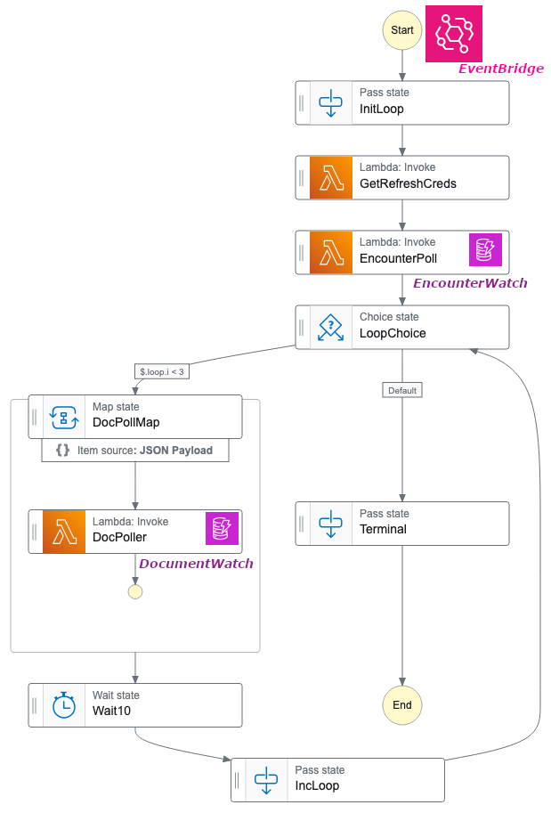
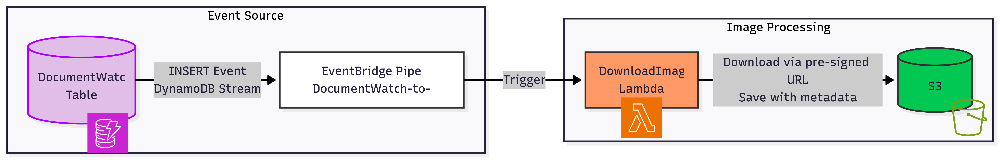
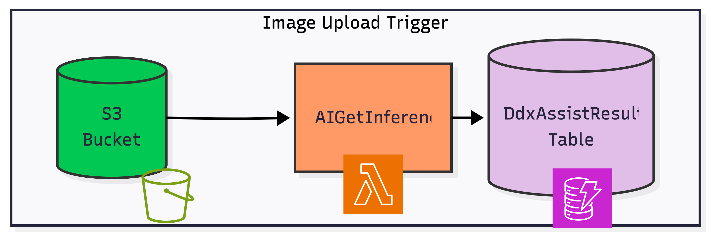
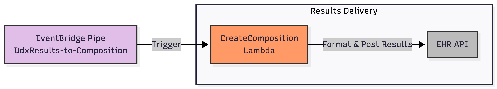

# **AI Skin Assist: Architecture for High-Frequency EMR Integration**

Author: Colin Murphy
Status: Production / Active
Tags: AWS Serverless, FHIR, HealthTech, Distributed Systems, AI

## **1\. Abstract**

This paper details the architecture of "AI Skin Assist," a third-party backend system designed to provide automated diagnostic support within an Electronic Medical Record (EMR) environment. The system integrates with the platform via the HL7 FHIR standard to analyze patient data.

A critical challenge during implementation was the discovery that the target EHR API lacked support for webhooks, rendering standard event-driven architectures impossible. This document outlines the development of a robust, high-frequency polling engine to emulate real-time responsiveness, ensuring practitioners receive diagnostic insights without manual triggers, despite the platform's native limitations.

## **2\. Context & Problem Statement**

### **2.1 The Objective**

To build a seamless clinical workflow that analyzes patient charts immediately upon data entry, providing differential diagnosis (DDx) suggestions without interrupting the physician's workflow or requiring external button clicks.

### **2.2 The Integration Constraint**

The system relies on a third-party EMR API, utilizing the **FHIR (Fast Healthcare Interoperability Resources)** standard for data interoperability. However, the API imposes strict rate limits and offers no push-notification capabilities (Webhooks) or subscription resources.

### **2.3 The Technical Failure Mode**

Modern distributed systems typically rely on **Webhooks** to trigger downstream actions (e.g., "Notify me when Note X is signed"). During the discovery phase, it was identified that the target API **does not support webhooks**.

**The Impact:**

* **No Real-Time Triggers:** The application had no way of "knowing" when a practitioner requested analysis.
* **Risk of Stale Data:** Without immediate notification, AI suggestions could lag behind the patient encounter.
* **Resource Load:** A naive solution would require constant, inefficient queries, potentially hitting API rate limits.

### **2.4 The Solution**

We engineered a **multi-threaded polling orchestration layer** utilizing AWS Step Functions and DynamoDB. This system monitors for state changes in the FHIR database, balancing strict latency requirements against API quotas.

## **3\. System Architecture**

To emulate real-time event processing within a polling environment, we utilized an **AWS Serverless** stack. The architecture decouples the "Polling" (finding work) from the "Processing" (doing work) to maximize throughput.

### **3.1 The Polling Orchestration (Step Functions)**

We utilized **AWS Step Functions** to manage the polling lifecycle. This state machine approach allows for sophisticated flow control, such as "Wait" states, parallel branching, and automatic retries, which are difficult to manage in standalone cron scripts.

  

**The Workflow Logic:**

1. **Trigger:** AWS EventBridge initiates the workflow every **n** minutes (e.g., 1 minute).
2. **Firm Discovery:** Scans DynamoDB for active customer firms.
3. **Credential Refresh (Map Sub-state):** \* Validates OAuth2 tokens against the EHR.
   * Automatically refreshes expired tokens before proceeding to ensure zero downtime.
4. **Encounter Poller:**
   * Queries the FHIR Encounter resource for updates since the last\_poll\_timestamp.
   * New encounters are pushed to an **EncounterWatch** table (DynamoDB).
   * **Lifecycle Management:** Records have a TTL (Time-to-Live) of 24 hours to ensure the system is stateless and self-cleaning.

### **3.2 Concurrency & Race Condition Handling (The "Lease" Pattern)**

Since the polling engine triggers frequently, there is a risk that a new poll begins before the previous batch of documents has finished processing.

* **The Problem:** Duplicate processing of the same patient chart, leading to redundant API calls and potential double-billing of AI inference costs.
* **The Solution:** We implemented a distributed locking mechanism via DynamoDB Conditional Writes.
  * When the **DocumentPoller** picks up a batch of encounters, it "leases" them by setting a locked\_until timestamp.
  * Other concurrent workers ignore these records until the lease expires or is released.

### **3.3 The Document Loop & Fan-Out**

Once active encounters are secured via lease, the system enters a tight loop to check for clinical documentation.

1. **Fan-Out Strategy:** The DocumentPoller utilizes a Map state to process firms concurrently.
2. **Classification:** The system identifies documents based on user-selected categories, mapping them to specialized models:
   * **Type A (Solitary):** e.g., Single lesions (Target: Object Detection, followed by Classification models).
   * **Type B (Widespread):** e.g., Rashes (Target: Classification models).
3. **Queueing:** Relevant documents are saved to a **DocumentWatch** table, which acts as an event trigger for the processing pipeline.

### **3.4 Operational Timeline & Latency Controls**

The following timeline illustrates the execution lifecycle for a single polling interval. This schedule ensures rows are "claimed" before heavy processing occurs, preventing overlap between parallel executions.

| Time            | Action                         | State Impact                                                        |
| :-------------- | :----------------------------- | :------------------------------------------------------------------ |
| **T+0**   | **Start**                | Workflow Triggered via EventBridge                                  |
| **T+5s**  | **Encounter Poller**     | New active encounters identified from EHR                           |
| **T+10s** | **Doc Poller (Iter 1\)** | 2 Parallel workers claim (lock) batch of 50 encounters each         |
|                 | *Lock Duration*              | Records locked for**30 seconds**                              |
| **T+20s** | **Wait State**           | System sleeps to respect API rate limits                            |
| **T+30s** | **Doc Poller (Iter 2\)** | Locks next batch; Iteration 1 locks expire/release                  |
| **T+40s** | **Wait State**           |                                                                     |
| **T+50s** | **Doc Poller (Iter 3\)** | Locks next batch                                                    |
| **T+60s** | **Overlap / Exit**       | Iteration 4 begins; Next Workflow Trigger fires (T+0 of next cycle) |

### **3.5 Image Processing Pipeline**

When a relevant document is detected, the system triggers an asynchronous processing chain.

#### **Phase 1: Ingestion**

  
 <!-- width="50%" height="50%"> -->

* **Trigger:** Insert to DocumentWatch table.
* **Action:** DownloadImage Lambda uses pre-signed URLs to securely fetch the asset.
* **Storage:** Image and metadata are saved to a secure, lifecycle-managed S3 bucket.

#### **Phase 2: Inference ([See repo for more detail](https://github.com/Curf/AIGetInference))**

* **Trigger:** Object creation in target S3 location.
* **Routing:** The AIGetInference Lambda routes the image to the correct SageMaker endpoint based on the classification tags (Solitary vs. Widespread).
* **LLM Synthesis:** The system compiles the computer vision probabilities (e.g., "Top-5 Classes") with patient context and passes a structured prompt to a Large Language Model (LLM).
* **Result:** Recommendations and next steps are saved to the AIAssistResults table.

### **3.6 Integration (Write-Back)**

The final step closes the loop by writing the AI's findings back into the EMR.

* **Trigger:** Insert to AIAssistResults table.
* **Composition:** Results are formatted into a FHIR Composition resource.
* **Delivery:** The data is posted back to the EHR API, appearing in the provider's chart as a draft transcription.

## **4\. Security & Compliance**

Given the sensitivity of healthcare data (PHI), the architecture adheres to strict HIPAA-compliant design patterns:

* **Ephemeral Processing:** Patient images are processed in memory where possible. Storage in S3 is strictly lifecycle-managed with immediate deletion policies after inference completion.
* **Encryption:** All data at rest (DynamoDB, S3) is encrypted using AWS KMS Customer Managed Keys. Data in transit is secured via TLS 1.2+.
* **Least Privilege:** Lambda execution roles are scoped strictly to the specific resources required (e.g., EncounterPoller cannot read from AIAssistResults).

## **5\. Summary of Technologies**

| Component               | Technology         | Purpose                                                        |
| :---------------------- | :----------------- | :------------------------------------------------------------- |
| **Orchestration** | AWS Step Functions | Managing polling logic, retries, and state.                    |
| **Database**      | Amazon DynamoDB    | Tracking state (leases), active firms, and results.            |
| **Compute**       | AWS Lambda         | Execution of discrete logic (Download, Inference, Write-back). |
| **Events**        | Amazon EventBridge | Scheduling the high-frequency polling triggers.                |
| **AI/ML**         | Amazon SageMaker   | Hosting custom computer vision models                          |
